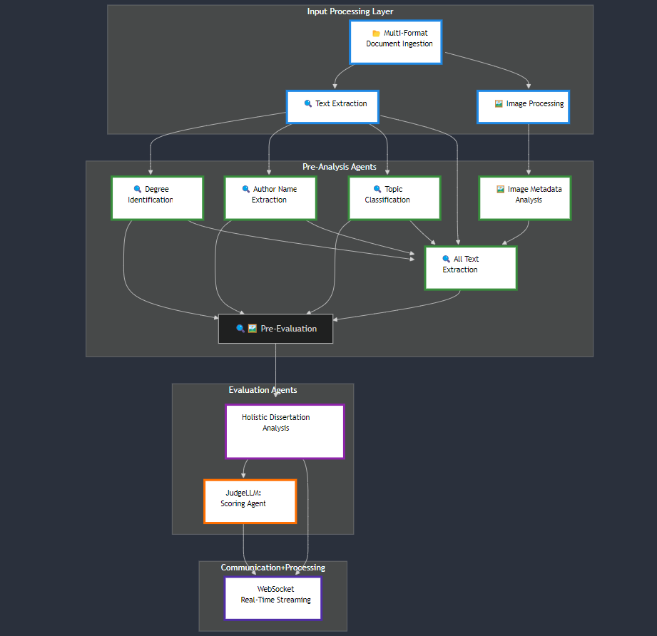

# Dissertation Analysis Platform

## Overview

The **Dissertation Analysis Platform** is an advanced computational solution built on the Spanda.AI Platform, designed to revolutionize academic dissertation evaluation through cutting-edge artificial intelligence and distributed computing technologies.

## Video Demo

[Watch Dissertation Analysis Demo on YouTube](https://www.youtube.com/watch?v=CWttOFzm7fY)

## Flow Chart


## Brief Overview

The system is designed to evaluate and analyze dissertations submitted by graduate students, leveraging advanced analytics to assess the quality, originality, and impact of research outputs. By integrating sophisticated computational techniques, the platform helps academic committees ensure high standards in academic research.

## Key Features

### Comprehensive Evaluation
- **Intelligent Dissertation Assessment**: Analyzes various aspects of dissertations, including structure, content quality, originality, and academic standards
- **Customizable Evaluation Criteria**: Allows definition of specific parameters based on departmental or institutional standards
- **Automated Reporting**: Generates detailed reports highlighting areas of excellence and suggesting improvements

### Technological Innovations
- **Multi-Agent Architecture**: Sophisticated system with specialized agents for comprehensive analysis
- **Advanced AI Processing**: Intelligent, collaborative agent interactions
- **Scalable Design**: Modular, event-driven microservices architecture

## System Components

### Agent Architecture
1. **Coordinator Agent (JudgeLLM)**
   - Central decision-making entity
   - Synthesizes insights from specialized agents
   - Provides comprehensive dissertation evaluation

2. **Specialized Analysis Agents**
   - Domain-specific expertise models
   - Targeted analysis across multiple dissertation dimensions

### Processing Layers
- **Input Processing Layer**
  - Multi-format document support
  - Advanced text extraction
  - Image processing capabilities

- **Intelligent Agent Workflow**
  - Pre-Analysis Agents
  - Evaluation Agents
  - Batch Processing Strategy

## Technical Specifications

### Communication
- **WebSocket Protocol**
  - Real-time data exchange
  - Robust error handling
  - Dynamic connection management

### Request Management
- Apache Kafka-powered queuing system
- Exactly-once processing semantics
- Intelligent load balancing
- Priority-based request handling

## Performance Capabilities
- Horizontal and vertical scaling
- Configurable concurrent user limits
- Dynamic resource allocation
- Graceful performance degradation

## Prerequisites

Before running the project, ensure you have:
- Python 3.10
- Docker

## Dissertation Analysis Application Setup Guide

### 1. Clone the Repository
```bash
git clone <repository-url>
```

### 2. Navigate to the Repository
```bash
cd dissertation-analysis
```

### 3. Run Quickstart Script

#### For Linux to build the docker image from source files
```bash
cd Docker-build
chmod +x build.sh
./build.sh
```
#### For Linux to use latest existing image of application
```bash
cd Docker
docker network create app_network
docker compose up
```

#### For Windows to build the docker image from source files
```cmd
./quickstart.bat
```
#### For Windows to use latest existing image of application
```cmd

```

## Troubleshooting
- Ensure Docker is installed and running
- Check that you have the required permissions
- Verify your Hugging Face token is valid
- Confirm all environment variables are correctly set

## Notes
- Make sure to keep your `.env` file secure and do not commit it to version control
- If you encounter any issues, check the Docker logs for detailed error messages

## Steps to build the backend of the Application

### Build from Source

1. **Clone the Dissertation-Analysis Repository**

2. **Create and Initialize a Python Environment**

For Linux/macOS:
```bash
python3 -m virtualenv venv
source venv/bin/activate
```

For Windows:
```bash
python -m virtualenv venv
venv/scripts/activate
```

3. **Install Dependencies**

```bash
pip install -r requirements.txt
pip install -e .
```

4. **Launch Dissertation Analysis**

```bash
da-start
```

> You can specify the --port and --host via flags

## Frontend Integration

For a complete frontend solution, refer to:
- [Dissertation Application Frontend](https://github.com/spandaai/dissertation-frontend)
- **Apache Superset Analytics Integration**: Provides detailed visual analytics and dashboards

## Computational Innovations
- **PagedAttention Memory Management**: Groundbreaking technique for efficient token processing
- **Activation-aware Weight Quantization (AWQ)**: Advanced model optimization strategy

## Acknowledgments
Developed utilizing the comprehensive computational infrastructure of the Spanda.AI Platform.

## Contributing
*Contribution guidelines to be added*

## License
*Specific licensing information to be determined*

## Contact
For more information, please contact the Spanda.AI Platform support team.

**Note**: This platform represents a cutting-edge approach to computational dissertation evaluation, integrating advanced AI, distributed computing, and intelligent agent technologies.
