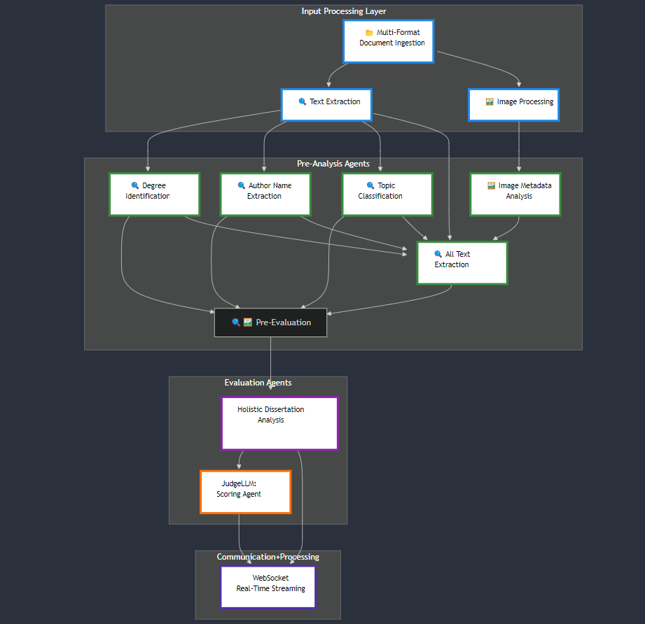

# Comprehensive Dissertation Analysis Application: An Advanced Computational Approach Built on the Spanda.AI Platform

## Abstract

The proliferation of academic research necessitates innovative computational approaches to dissertation evaluation. This technical paper introduces a groundbreaking Dissertation Analysis Platform developed atop the Spanda.AI Platform, presenting a sophisticated multi-agent architecture that revolutionizes academic document assessment through advanced natural language processing, machine learning, and distributed computing technologies.

## 1. Introduction

### 1.1 Context and Motivation

In the contemporary academic landscape, the complexity and volume of dissertations demand sophisticated analytical tools that transcend traditional evaluation methodologies. The Spanda.AI Platform provides a robust computational foundation that enables the development of an intelligent, scalable, and comprehensive Dissertation Analysis Platform.

### 1.2 Platform Foundation: Spanda.AI

The Dissertation Analysis Platform is a sophisticated application built exclusively on the Spanda.AI Platform, leveraging its advanced computational infrastructure, distributed processing capabilities, and intelligent agent framework. Spanda.AI serves as the critical technological substratum, enabling unprecedented levels of computational intelligence and architectural flexibility.

## 2. System Architecture

### 2.1 Architectural Overview

The platform is conceptualized as a multi-layered, event-driven microservices architecture, meticulously designed to provide comprehensive dissertation analysis through intelligent, collaborative agent interactions.

#### 2.1.1 Architectural Principles
- **Modularity**: Each system component operates as an independent, configurable module
- **Scalability**: Horizontal and vertical scaling capabilities
- **Intelligent Collaboration**: Agent-based processing with dynamic interaction protocols

### 2.2 Agent-Based Analysis Architecture

#### 2.2.1 Multi-Agent LLM Cluster Design

The core of the platform is a sophisticated multi-agent architecture powered by specialized Large Language Models (LLMs), strategically deployed on the Spanda.AI Platform:

##### Coordinator Agent (JudgeLLM)
- Primary decision-making computational entity
- Integrates and synthesizes insights from specialized agents
- Provides comprehensive dissertation evaluation
- Serves as the ultimate analytical arbiter

##### Specialized Analysis Agents
- Domain-specific expertise models
- Targeted analysis across multiple dissertation dimensions
- Utilize optimized, task-specific language models
- Generate granular, contextually rich insights

### 2.3 Advanced Computational Strategies

#### 2.3.1 Model Optimization Techniques

#### PagedAttention and Key-Value Caching
PagedAttention represents a groundbreaking memory management paradigm designed to revolutionize token processing and computational resource allocation in large language models. By implementing a dynamic, segmented memory allocation strategy, this technique fundamentally transforms how computational resources are utilized during inference and training processes. The core innovation of PagedAttention lies in its ability to dynamically partition and manage memory blocks, enabling more granular and flexible token processing. Traditional attention mechanisms often suffer from inefficient memory utilization, where contiguous memory allocations can lead to significant performance bottlenecks. PagedAttention addresses this challenge by introducing a flexible paging mechanism that allows for non-contiguous memory allocation, substantially improving overall system efficiency.
Key benefits of this approach include:
- Enhanced memory utilization through intelligent segmentation
- Reduced memory fragmentation
- Improved scalability for large-scale language models
- More efficient handling of variable-length sequences
- Minimized computational overhead during token processing

The technique's sophisticated memory management enables models to handle increasingly complex computational tasks while maintaining optimal resource allocation, making it a critical advancement in machine learning infrastructure.

#### Quantization Methodology
The quantization methodology, specifically the Activation-aware Weight Quantization (AWQ) approach, represents a sophisticated technique for reducing computational complexity while preserving model performance. This innovative strategy transforms how neural networks manage numerical precision, enabling more efficient inference across various computational environments. Activation-aware Weight Quantization distinguishes itself by intelligently reducing the numerical precision of model weights with minimal performance degradation. Unlike traditional quantization methods that apply uniform reduction, AWQ dynamically adapts the quantization process based on activation patterns, ensuring that critical weight representations are preserved.
The methodology's primary objectives include:
- Dramatically reducing model size and memory requirements
- Maintaining high-fidelity inference capabilities
- Enabling deployment across resource-constrained environments
- Minimizing computational complexity without sacrificing accuracy
- Providing a flexible framework for model optimization
By carefully mapping weight distributions and identifying critical numerical ranges, AWQ achieves a delicate balance between model compression and performance preservation. This approach allows for significant reductions in computational and memory footprints while ensuring that the model's core representational capabilities remain intact.
The quantization strategy becomes particularly valuable in edge computing, mobile applications, and scenarios requiring low-latency, resource-efficient machine learning deployments. Its adaptive nature ensures that models can be efficiently scaled and deployed across diverse computational landscapes without compromising their fundamental learning capabilities.

## 3. Processing Architecture

### 3.1 Input Processing Layer

The input processing layer represents the initial computational interface for dissertation document ingestion, supporting multiple document formats through advanced parsing mechanisms.

#### 3.1.1 Text Extraction Capabilities
- Multi-format document processing
- Sophisticated text normalization
- Structural document preservation
- Advanced formatting maintenance

#### 3.1.2 Image Processing Workflow
- Concurrent, batch-oriented image analysis
- Intelligent image context preservation
- Integrated visual-textual understanding

### 3.2 Intelligent Agent Workflow

#### 3.2.1 Pre-Analysis Agents
Specialized agents designed for initial document metadata extraction:
- Degree identification: Extracting academic degree information from dissertation headers and metadata
- Author name extraction: Precise identification and standardization of author names
- Topic and domain classification: Systematic categorization of research domains and specific subject areas
- Image Metadata Agents: Image Type Identification (charts, graphs, photographs, diagrams), Image analysis, Image detection. All images embedded in the document are analyzed

#### 3.2.2 Evaluation Agents
Comprehensive analytical agents providing nuanced dissertation assessment:
- Holistic dissertation analysis: Integrated review of textual and visual content
- Intelligent scoring mechanisms: Multi-dimensional evaluation criteria or rubric
- Contextual feedback generation: Contextually aware insights and recommendations

#### 3.2.3 Batch Processing Strategy
The platform employs a sophisticated hybrid processing approach to optimize the evaluation workflow for analytical agents. Each dissertation document undergoes initial processing individually, and within this context, a combination of batch and sequential processing is applied to the analytical agents. This nuanced strategy balances computational efficiency and flexibility.

For each document, multiple analytical agents are processed in batches wherever possible, enabling significant computational gains by leveraging parallel execution. This batch approach reduces analysis time and enhances resource utilization, particularly for agents that can operate independently. At the same time, sequential processing is employed for agents with interdependencies or those requiring ordered execution, ensuring accurate and coherent results.

This dual-layered strategy enables the platform to handle large volumes of academic documents efficiently while maintaining the high-quality, precise analysis required for diverse dissertation inputs. The use of batch processing allows for horizontal scaling, distributing tasks across multiple processing nodes and enhancing system resilience. Sequential processing ensures that dependent analyses are conducted with precision, supporting robust and context-aware evaluations.

By processing each document independently and employing a tailored combination of batch and sequential processing for its analytical agents, the platform achieves a scalable, resilient, and high-performance analysis framework that aligns with the diverse requirements of academic research evaluation.
### 3.3 Communication Architecture

#### 3.3.1 WebSocket Communication Protocol
The WebSocket communication protocol serves as the cornerstone of our real-time data exchange mechanism, designed to provide seamless, high-performance communication between client and server components. This advanced protocol enables sophisticated real-time analysis streaming, allowing for dynamic and progressive result rendering that transforms user interaction paradigms.
The architecture implements robust error handling mechanisms that ensure system resilience and reliability. By anticipating potential communication disruptions, the protocol incorporates multiple layers of connection validation, automatic reconnection strategies, and comprehensive error logging. These mechanisms guarantee that transient network issues do not compromise data integrity or user experience.
Dynamic connection management is a critical feature of this communication architecture. The system intelligently monitors WebSocket connections, implementing adaptive timeout strategies, connection pooling, and intelligent retry mechanisms. This approach ensures optimal resource utilization while maintaining low-latency communication channels that can dynamically scale with varying computational demands.

### 3.4 Request Management

#### 3.4.1 Kafka-Powered Queuing System
Our request management infrastructure leverages Apache Kafka to create a robust, distributed request processing ecosystem. By utilizing Kafka's distributed messaging capabilities, the system achieves unprecedented scalability and reliability in handling complex computational workloads.
The queuing system guarantees message delivery through advanced persistence and replication strategies. Each incoming request is meticulously tracked, with comprehensive logging and exactly-once processing semantics. This approach ensures that no computational task is lost, even in scenarios involving network partitions or temporary service interruptions.
Intelligent load balancing is achieved through sophisticated request distribution algorithms that dynamically analyze system resources, current computational load, and historical performance metrics. The system can intelligently route requests across multiple worker nodes, optimizing resource utilization and minimizing response latencies.
Priority-based request handling introduces a nuanced approach to computational resource allocation. Critical tasks receive expedited processing, while lower-priority requests are gracefully queued and processed according to configurable service-level agreements. This mechanism ensures that time-sensitive computational tasks receive immediate attention without compromising the overall system's fairness and efficiency.

## 4 Resource Management
- Configurable concurrent user limits
- Dynamic resource allocation
- Intelligent request routing
- Graceful performance degradation

## 5. Conclusion

The Dissertation Analysis Platform, built upon the Spanda.AI Platform, represents a paradigm shift in computational dissertation evaluation. By integrating advanced artificial intelligence, distributed computing, and intelligent agent technologies, the platform offers an unprecedented approach to academic document analysis.

The system's design principles of modularity, asynchronous processing, and intelligent computational analysis create a transformative tool capable of adapting to diverse academic research contexts while maintaining exceptional performance, reliability, and scalability.

## 6. Acknowledgments

This research and technological development were made possible through the comprehensive computational infrastructure provided by the Spanda.AI Platform.
